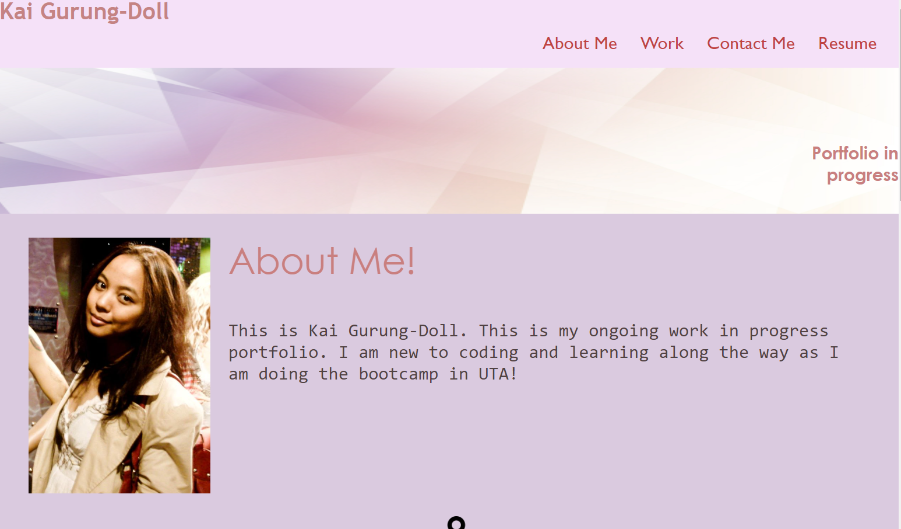
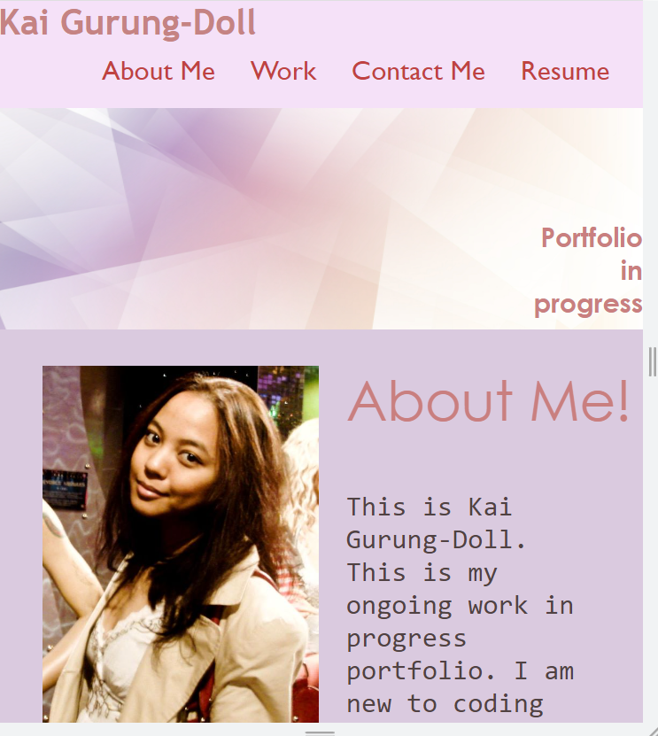
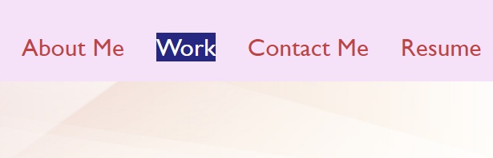
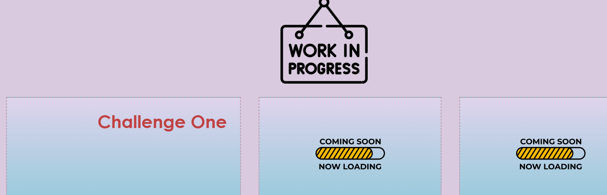
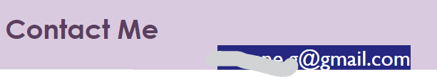

# Challenge-Two-UTA

**Title: Challenge Two
Devoloper: Kai Gurung-Doll
Deployment date: 9/26/23
For: University of Texas Austin Coding Bootcamp
Built with: HTML & CSS**

This challenge was challenging. The task was as following:
- Website link works & has a recent picture of the developer. 
- Hyperlink works on the website.
- When clicked on the link it corresponds to certain section on the website.
- The first application is present larger than the rest of the application (work).
- Resizing the page or view screen adapts to viewport. 
  
**Task that was successful:**

_Big Screen_

*Smaller Screen*

*The links jumps to the section below*

*Opens to email*

**Task that I still need to work on:**
Need to work on Flexbox!

Images sourced from *Pizabay*

Link: https://kaidoll.github.io/Challenge-Two-UTA/